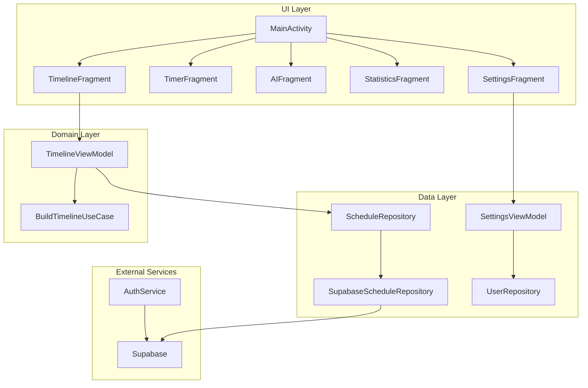

# 📊 Tiramisu AI Planner - Project Analysis

## 1. Tổng quan kiến trúc hiện tại



---

## 2. Tech Stack đang sử dụng

| Category | Technology |
|----------|------------|
| **Language** | Kotlin |
| **Min SDK** | 26 (Android 8.0) |
| **Target SDK** | 36 |
| **Architecture** | MVVM + Repository Pattern |
| **Backend** | Supabase (postgrest, gotrue, storage) |
| **HTTP Client** | Ktor Client Android, Retrofit, OkHttp |
| **Serialization** | kotlinx.serialization, Gson |
| **Navigation** | Jetpack Navigation Component |
| **UI** | ViewBinding, Material Design 3 |
| **Charts** | MPAndroidChart |
| **Security** | androidx.security-crypto |

---

## 3. Cấu trúc thư mục hiện tại

```
com.projectapp.tempus/
├── core/
│   └── supabase/
│       └── SupabaseClientProvider.kt
├── data/
│   ├── auth/
│   │   └── AuthService.kt
│   ├── schedule/
│   │   ├── ScheduleRepository.kt
│   │   ├── SupabaseScheduleRepository.kt
│   │   └── dto/
│   │       ├── Enums.kt (RepeatType, SourceType, StatusType, ScheduleLabel)
│   │       ├── ScheduleRow.kt
│   │       ├── ScheduleItemRow.kt
│   │       └── EditedVersionRow.kt
│   └── user/
│       ├── UserRepository.kt
│       ├── SupabaseUserRepository.kt
│       └── dto/
├── domain/
│   ├── model/
│   │   └── TimelineBlock.kt
│   ├── usecase/
│   │   └── BuildTimelineUseCase.kt
│   └── user/
├── ui/
│   ├── auth/
│   │   ├── LoginActivity.kt
│   │   └── RegisterActivity.kt
│   ├── setting/
│   │   ├── SettingsViewModel.kt
│   │   ├── ProfileActivity.kt
│   │   └── PersonalizationActivity.kt
│   └── timeline/
│       ├── TimelineViewModel.kt
│       ├── TimelineAdapter.kt
│       ├── EditScheduleFragment.kt
│       ├── EditScheduleViewModel.kt
│       ├── WeekAdapter.kt
│       └── MonthCalendarDialogFragment.kt
├── MainActivity.kt
├── TimeLineFragment.kt
├── TimerFragment.kt
├── AIFragment.kt
├── StatisticsFragment.kt
└── SettingsFragment.kt
```

---

## 4. Features Status Matrix

### ✅ Hoàn thành (Complete)

| Feature | Files chính | Notes |
|---------|-------------|-------|
| **Authentication** | `AuthService.kt`, `LoginActivity.kt`, `RegisterActivity.kt` | Email/Password + Reset Password |
| **Task CRUD** | `ScheduleRepository.kt`, `SupabaseScheduleRepository.kt` | Insert, Update, Delete, Upsert |
| **Timeline View** | `TimeLineFragment.kt`, `TimelineAdapter.kt`, `TimelineViewModel.kt` | Week navigation, Month dialog |
| **Edit Schedule** | `EditScheduleFragment.kt`, `EditScheduleViewModel.kt` | Full edit form |
| **Repeat Logic** | `Enums.kt`, `TimelineViewModel.kt` | once, daily, weekly, monthly |
| **Supabase Integration** | `SupabaseClientProvider.kt` | Client singleton pattern |

### 🟡 Chưa hoàn thiện (Partial)

| Feature | Current State | Missing |
|---------|---------------|---------|
| **Timer** | UI countdown works | Pomodoro sessions, ForegroundService, logging |
| **Statistics** | Chart UI ready | Real data connection, aggregation queries |
| **Settings** | Layout ready | Profile edit logic, Personalization logic |
| **Logout** | Basic logout | Proper session cleanup |

### ❌ Chưa triển khai (Not Implemented)

| Feature | Complexity | Dependencies |
|---------|------------|--------------|
| **AI Chat Box** | HIGH | OpenAI API, Chat UI, Schedule parsing |
| **Notifications** | HIGH | AlarmManager, NotificationManager, Permissions |
| **Quick Notes** | MEDIUM | Room table, Notes UI |
| **Home Widget** | MEDIUM | AppWidgetProvider, RemoteViews |
| **Daily Quote** | LOW | Quote API or local list |
| **Persona/Routine** | MEDIUM | DataStore, Constraints logic |
| **Privacy/Export** | MEDIUM | BiometricPrompt, File export |
| **Search/Filter** | LOW | Query modifications, Filter UI |
| **Gamification** | HIGH | Points system, Tree growth, Animations |

---

## 5. Database Schema (Supabase)

### Bảng hiện có

```sql
-- schedule (main tasks)
CREATE TABLE schedule (
    id UUID PRIMARY KEY,
    user_id UUID REFERENCES auth.users,
    name_schedule TEXT,
    icon_id INTEGER,
    start_time_date TIMESTAMPTZ,
    implementation_time INTERVAL,
    repeat TEXT, -- 'once', 'daily', 'weekly', 'monthly'
    color TEXT,
    source TEXT, -- 'manual', 'ai'
    label TEXT,
    created_at TIMESTAMPTZ DEFAULT now()
);

-- schedule_items (per-date status)
CREATE TABLE schedule_items (
    id UUID PRIMARY KEY,
    task_id UUID REFERENCES schedule(id),
    date DATE,
    status TEXT, -- 'planned', 'done', 'skip', 'delete'
    edited_version UUID,
    updated_at TIMESTAMPTZ
);

-- edited_version (per-date overrides)
CREATE TABLE edited_version (
    id UUID PRIMARY KEY,
    label TEXT,
    -- other override fields
);
```

### Bảng cần thêm

```sql
-- notes (Quick Notes feature - Dev 1)
CREATE TABLE notes (
    id UUID PRIMARY KEY,
    user_id UUID REFERENCES auth.users,
    content TEXT,
    created_at TIMESTAMPTZ DEFAULT now(),
    updated_at TIMESTAMPTZ
);

-- timer_sessions (Pomodoro feature - Dev 2)
CREATE TABLE timer_sessions (
    id UUID PRIMARY KEY,
    user_id UUID REFERENCES auth.users,
    task_id UUID REFERENCES schedule(id),
    started_at TIMESTAMPTZ,
    ended_at TIMESTAMPTZ,
    duration_minutes INTEGER,
    session_type TEXT, -- 'focus', 'break'
    completed BOOLEAN
);

-- user_points (Gamification - Dev 4)
CREATE TABLE user_points (
    id UUID PRIMARY KEY,
    user_id UUID REFERENCES auth.users UNIQUE,
    total_points INTEGER DEFAULT 0,
    current_streak INTEGER DEFAULT 0,
    longest_streak INTEGER DEFAULT 0,
    updated_at TIMESTAMPTZ
);

-- trees (Gamification - Dev 4)
CREATE TABLE trees (
    id UUID PRIMARY KEY,
    user_id UUID REFERENCES auth.users,
    tree_type TEXT,
    state TEXT, -- 'seed', 'sprout', 'sapling', 'tree', 'dead'
    planted_at TIMESTAMPTZ,
    last_watered_at TIMESTAMPTZ,
    points_invested INTEGER DEFAULT 0
);
```

---

## 6. API Endpoints cần tích hợp

| API | Purpose | Dev |
|-----|---------|-----|
| **OpenAI Chat Completions** | AI scheduling suggestions | Dev 1 |
| **Quote API** (ZenQuotes, etc.) | Daily motivation | Dev 1 |

---

## 7. Permissions cần thêm

```xml
<!-- AndroidManifest.xml -->
<uses-permission android:name="android.permission.POST_NOTIFICATIONS" />
<uses-permission android:name="android.permission.SCHEDULE_EXACT_ALARM" />
<uses-permission android:name="android.permission.FOREGROUND_SERVICE" />
<uses-permission android:name="android.permission.USE_BIOMETRIC" />
<uses-permission android:name="android.permission.VIBRATE" />
```

---

## 8. Risks & Mitigation

| Risk | Impact | Mitigation |
|------|--------|------------|
| OpenAI API costs | HIGH | Use free tier, implement caching |
| Background restrictions (Android 12+) | MEDIUM | Use exact alarms properly, WorkManager fallback |
| Offline sync conflicts | MEDIUM | Implement proper merge strategy with `updated_at` |
| Complex gamification logic | MEDIUM | Start simple, iterate |
